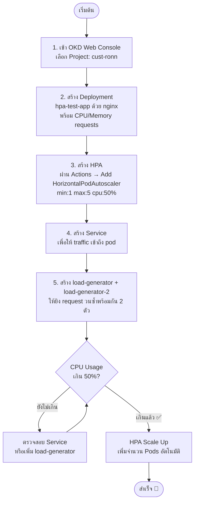
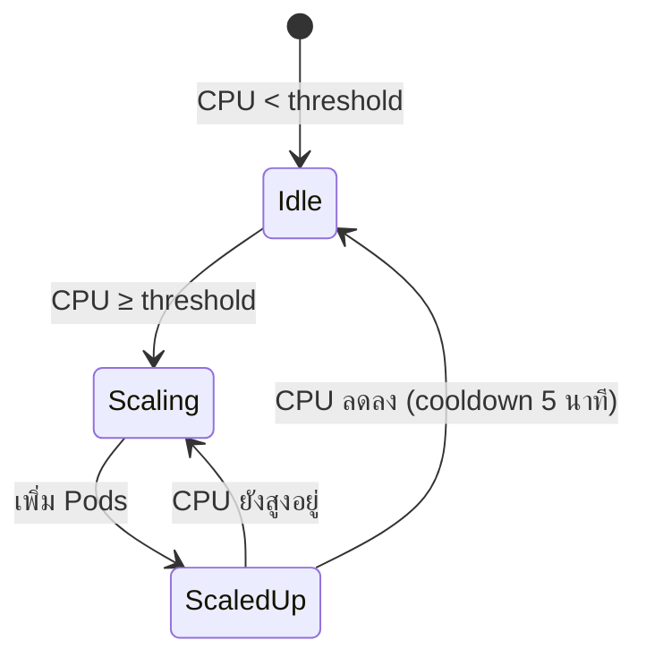
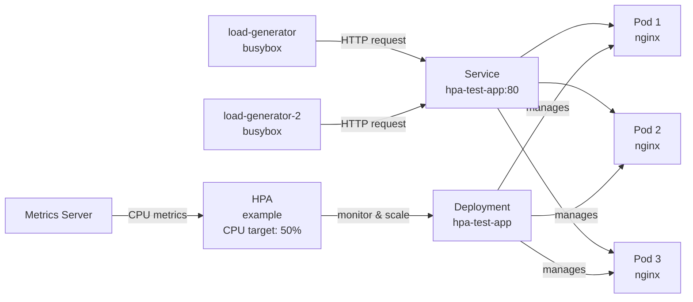
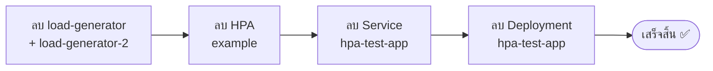

# คู่มือทดสอบ HPA (Horizontal Pod Autoscaler) บน OKD

## ภาพรวมขั้นตอนทั้งหมด



---

## ขั้นตอนที่ 1 — สร้าง Deployment

ไปที่ **"+" → Import YAML** แล้ว paste YAML ต่อไปนี้:

```yaml
apiVersion: apps/v1
kind: Deployment
metadata:
  name: hpa-test-app
  namespace: cust-ronn
spec:
  replicas: 1
  selector:
    matchLabels:
      app: hpa-test-app
  template:
    metadata:
      labels:
        app: hpa-test-app
    spec:
      containers:
        - name: hpa-test-app
          image: nginx:latest
          resources:
            requests:
              cpu: "100m"
              memory: "128Mi"
            limits:
              cpu: "200m"
              memory: "256Mi"
```

> ⚠️ ต้องกำหนด `resources.requests` ไม่เช่นนั้น HPA จะคำนวณ CPU ไม่ได้

---

## ขั้นตอนที่ 2 — สร้าง HPA

ไปที่ **Workloads → Deployments → hpa-test-app → Actions → Add HorizontalPodAutoscaler**

กำหนดค่า:

| ฟิลด์ | ค่า |
|---|---|
| Name | example |
| Min replicas | 1 |
| Max replicas | 5 |
| CPU utilization | 50% |

กด **Save**

---

## ขั้นตอนที่ 3 — สร้าง Service

ไปที่ **"+" → Import YAML** แล้ว paste:

```yaml
apiVersion: v1
kind: Service
metadata:
  name: hpa-test-app
  namespace: cust-ronn
spec:
  selector:
    app: hpa-test-app
  ports:
    - protocol: TCP
      port: 80
      targetPort: 80
```

> Service นี้ทำให้ load-generator ส่ง traffic ถึง pod ได้

---

## ขั้นตอนที่ 4 — สร้าง Load Generator (2 ตัว)

> 💡 ต้องใช้ 2 ตัวเพราะ `busybox wget` ยิง request แบบ sequential ตัวเดียวสร้าง load ได้ไม่พอที่จะ push CPU เกิน 50% อย่างต่อเนื่อง

ไปที่ **"+" → Import YAML** แล้ว paste ทีละตัว:

**load-generator (ตัวที่ 1)**
```yaml
apiVersion: v1
kind: Pod
metadata:
  name: load-generator
  namespace: cust-ronn
spec:
  containers:
    - name: load-generator
      image: registry.access.redhat.com/ubi8/ubi-minimal:latest
      command: ["/bin/sh", "-c"]
      args:
        - "while true; do curl -s http://hpa-test-app > /dev/null; done"
```

**load-generator-2 (ตัวที่ 2)**
```yaml
apiVersion: v1
kind: Pod
metadata:
  name: load-generator-2
  namespace: cust-ronn
spec:
  containers:
    - name: load-generator
      image: registry.access.redhat.com/ubi8/ubi-minimal:latest
      command: ["/bin/sh", "-c"]
      args:
        - "while true; do curl -s http://hpa-test-app > /dev/null; done"
```

> 💡 ใช้ `registry.access.redhat.com` เพราะเป็น Red Hat official registry ไม่มี rate limit และ OKD รองรับโดยตรง ใช้ `curl` แทน `wget`

---

## ขั้นตอนที่ 5 — ดูผลลัพธ์

ไปที่ **Workloads → HorizontalPodAutoscalers → example**



สิ่งที่ควรเห็น:
- **Current CPU** — เพิ่มขึ้นเรื่อยๆ
- **Current replicas** — เพิ่มจาก 1 → หลาย pod
- **Last scale time** — แสดงเวลาที่ scale ครั้งล่าสุด

---

## Troubleshooting

| ปัญหา | สาเหตุ | วิธีแก้ |
|---|---|---|
| CPU ไม่ขึ้น | ไม่มี Service | สร้าง Service ตามขั้นตอนที่ 3 |
| CPU ไม่ถึง threshold | load-generator ตัวเดียวไม่พอ | เพิ่ม load-generator-2 |
| Error: object has been modified | HPA อัปเดตตัวเองพอดี | Refresh หน้าแล้วแก้ใหม่ |
| HPA disabled (สีเทา) | ไม่มี resource requests | เพิ่ม `resources.requests` ใน Deployment |

---

## สถาปัตยกรรมโดยรวม



---

## ขั้นตอนที่ 6 — ลบ Resources หลังทดสอบเสร็จ

> ⚠️ ควรลบตามลำดับด้านล่าง เพื่อป้องกัน HPA พยายาม scale ขณะกำลังลบ Deployment



### วิธีลบผ่าน UI

**1. ลบ Load Generators**
**Workloads → Pods** → คลิก ⋮ ข้าง `load-generator` → **Delete Pod** → ทำซ้ำกับ `load-generator-2`

**2. ลบ HPA**
**Workloads → HorizontalPodAutoscalers** → คลิก ⋮ ข้าง `example` → **Delete HorizontalPodAutoscaler**

**3. ลบ Service**
**Networking → Services** → คลิก ⋮ ข้าง `hpa-test-app` → **Delete Service**

**4. ลบ Deployment**
**Workloads → Deployments** → คลิก ⋮ ข้าง `hpa-test-app` → **Delete Deployment**

### ตรวจสอบหลังลบ
ไปที่ **Workloads → Pods** ควรเหลือแค่ `phpmyadmin` เท่านั้น