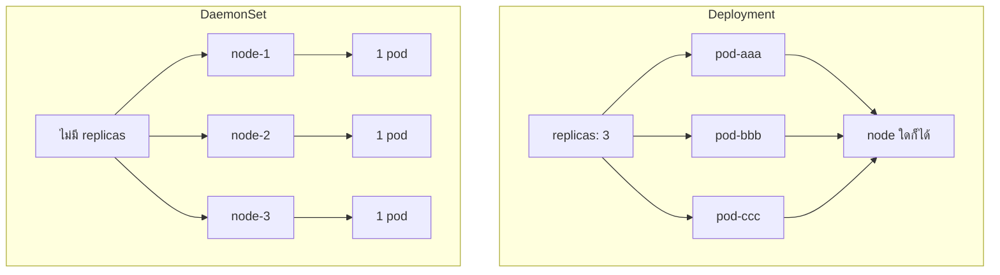
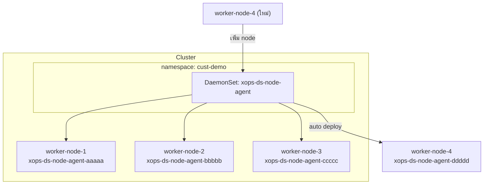
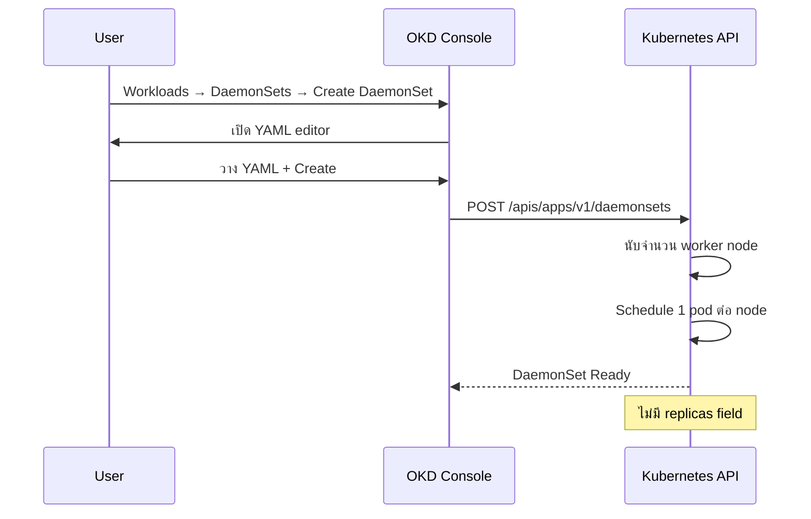
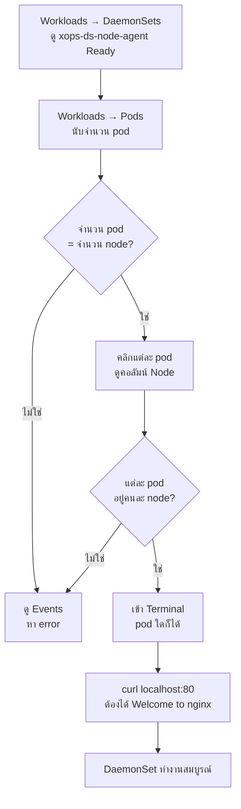
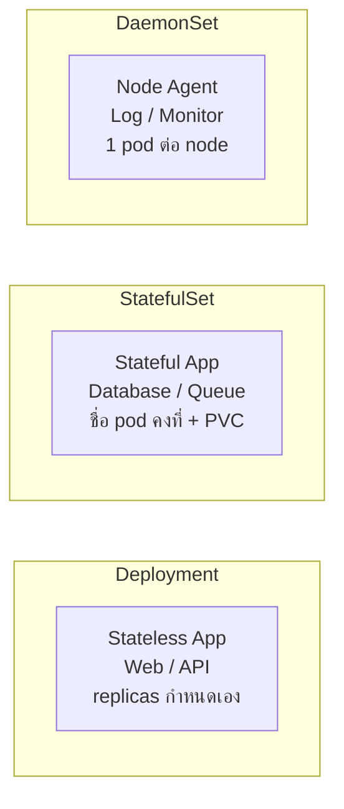

# DaemonSet — Node Agent บน OpenLandscape Cloud

> **Platform:** OpenLandscape (OKD)
> **Namespace:** `cust-demo`
> **Team:** xops
> **Version:** 1.0 · เมษายน 2569

---

## 1. DaemonSet คืออะไร

DaemonSet คือ workload ที่สั่งให้ Kubernetes deploy **1 pod ต่อ 1 node** อัตโนมัติ เมื่อเพิ่ม node ใหม่ pod จะถูกสร้างทันที เมื่อลบ node pod จะหายไปเองโดยไม่ต้องสั่ง



---

## 2. Use Case

| Use Case | ตัวอย่าง |
|---|---|
| Log collector | Fluentd, Filebeat |
| Monitoring agent | Prometheus Node Exporter |
| Network plugin | Calico, Cilium |
| Security scanner | Falco |
| Demo / ทดสอบ | nginx จำลอง agent |

---

## 3. Architecture Overview



---

## 4. ลำดับการสร้าง



---

## 5. YAML + คำอธิบาย

```yaml
apiVersion: apps/v1
kind: DaemonSet
metadata:
  name: xops-ds-node-agent      # ชื่อ DaemonSet
  namespace: cust-demo
spec:
  selector:
    matchLabels:
      app: xops-node-agent       # ต้องตรงกับ template.labels
  template:
    metadata:
      labels:
        app: xops-node-agent
    spec:
      containers:
        - name: node-agent
          image: quay.io/jitesoft/nginx:latest   # image ที่ผ่านแล้ว
          ports:
            - containerPort: 80
          resources:
            requests:
              cpu: 50m            # ใช้ resource น้อย เพราะรันทุก node
              memory: 64Mi
            limits:
              cpu: 100m
              memory: 128Mi
```

> **หมายเหตุ:** ไม่มี `replicas` field — DaemonSet ควบคุมจำนวน pod เองตาม node

---

## 6. ตรวจสอบหลัง Deploy

| ไปดูที่ | สิ่งที่ควรเห็น |
|---|---|
| Workloads → DaemonSets | `xops-ds-node-agent` สถานะ Ready |
| Workloads → Pods | pod ชื่อ `xops-ds-node-agent-xxxxx` หลายตัว |
| คอลัมน์ Node ใน Pods list | แต่ละ pod อยู่คนละ node |
| จำนวน pod | ต้องเท่ากับจำนวน worker node |

---

## 7. ทดสอบ



**คำสั่งทดสอบใน Terminal**

```bash
# ตรวจว่า process ทำงาน
ps aux

# ทดสอบ port
curl localhost:80
```

---

## 8. Resource Summary

| Resource | ชื่อ | หมายเหตุ |
|---|---|---|
| DaemonSet | `xops-ds-node-agent` | 1 pod ต่อ worker node |
| Pod | `xops-ds-node-agent-xxxxx` | ชื่อ random ต่อ node |
| Service | ไม่จำเป็น | ขึ้นอยู่กับ use case |
| PVC | ไม่มี | agent ไม่ต้องการ persistent storage |

---

## เปรียบเทียบ 3 Workload Types

