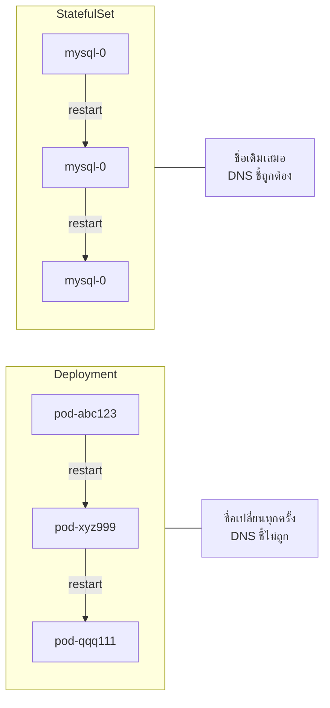
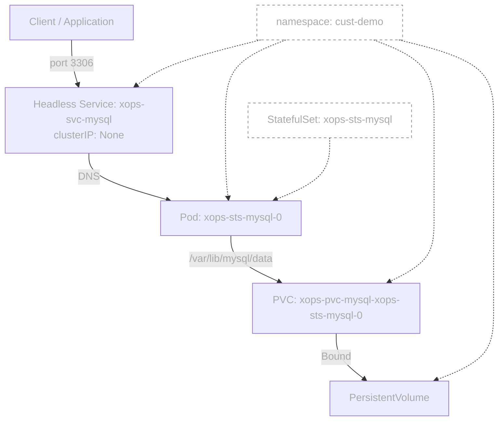
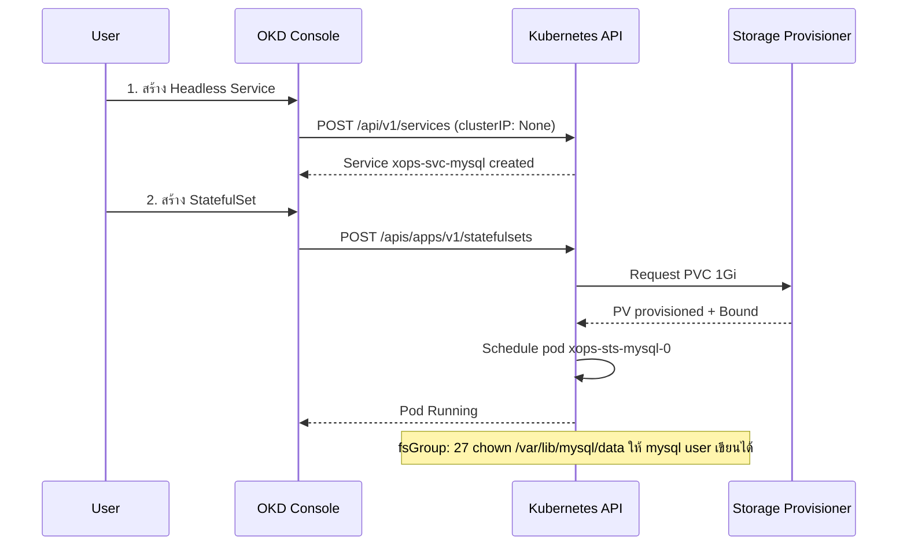
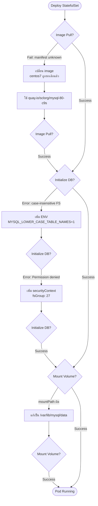
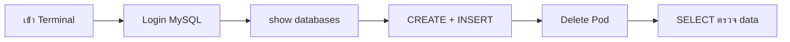

# StatefulSet — MySQL บน OpenLandscape Cloud

> **Platform:** OpenLandscape (OKD)
> **Namespace:** `cust-demo`
> **Team:** xops
> **Version:** 1.0 · เมษายน 2569

---

## ทำไมต้อง StatefulSet?



**ความต่างหลัก**

| | Deployment | StatefulSet |
|---|---|---|
| ชื่อ Pod | random hash | ลำดับคงที่ เช่น `mysql-0` |
| Storage | ใช้ร่วมกันหรือไม่มี | PVC ของตัวเองต่อ pod |
| การ deploy | พร้อมกัน | ทีละตัว ตามลำดับ |
| ใช้กับ | Web, API | Database, Queue |

---

## Architecture Overview



---

## ลำดับการสร้าง Resource



---

## Logic การแก้ปัญหาที่เจอ



---

## YAML ที่ใช้งานได้จริง

### 1. Headless Service

```yaml
apiVersion: v1
kind: Service
metadata:
  name: xops-svc-mysql
  namespace: cust-demo
spec:
  clusterIP: None        # Headless — ไม่มี VIP, ใช้ DNS แทน
  selector:
    app: xops-mysql
  ports:
    - port: 3306
      targetPort: 3306
```

### 2. StatefulSet

```yaml
apiVersion: apps/v1
kind: StatefulSet
metadata:
  name: xops-sts-mysql
  namespace: cust-demo
spec:
  serviceName: xops-svc-mysql
  replicas: 1
  selector:
    matchLabels:
      app: xops-mysql
  template:
    metadata:
      labels:
        app: xops-mysql
    spec:
      securityContext:
        fsGroup: 27                    # chown volume ให้ mysql user (UID/GID=27)
      containers:
        - name: mysql
          image: quay.io/sclorg/mysql-80-c9s:latest
          ports:
            - containerPort: 3306
          env:
            - name: MYSQL_ROOT_PASSWORD
              value: "xops1234"
            - name: MYSQL_USER
              value: "xopsuser"
            - name: MYSQL_PASSWORD
              value: "xops5678"
            - name: MYSQL_DATABASE
              value: "xopsdb"
            - name: MYSQL_LOWER_CASE_TABLE_NAMES
              value: "1"               # แก้ case-insensitive FS ของ cluster
          resources:
            requests:
              cpu: 100m
              memory: 256Mi
            limits:
              cpu: 200m
              memory: 512Mi
          volumeMounts:
            - name: xops-pvc-mysql
              mountPath: /var/lib/mysql/data   # sclorg ใช้ /data ไม่ใช่ /mysql
  volumeClaimTemplates:
    - metadata:
        name: xops-pvc-mysql
      spec:
        accessModes: ["ReadWriteOnce"]
        resources:
          requests:
            storage: 1Gi
```

---

## การทดสอบ



| ขั้นตอน | คำสั่ง |
|---|---|
| Login MySQL | `mysql -u xopsuser -pxops5678 xopsdb` |
| ตรวจ database | `show databases;` |
| สร้าง table | `CREATE TABLE test (id INT, name VARCHAR(50));` |
| Insert data | `INSERT INTO test VALUES (1, 'xops-test');` |
| ตรวจ data | `SELECT * FROM test;` |
| Delete Pod | Actions → Delete Pod → รอ Running |
| ตรวจหลัง restart | `SELECT * FROM test;` — data ต้องยังอยู่ |

---

## Resource Summary

| Resource | ชื่อ | หมายเหตุ |
|---|---|---|
| Headless Service | `xops-svc-mysql` | clusterIP: None |
| StatefulSet | `xops-sts-mysql` | replicas: 1 |
| Pod | `xops-sts-mysql-0` | ชื่อคงที่เสมอ |
| PVC | `xops-pvc-mysql-xops-sts-mysql-0` | auto-created โดย StatefulSet |