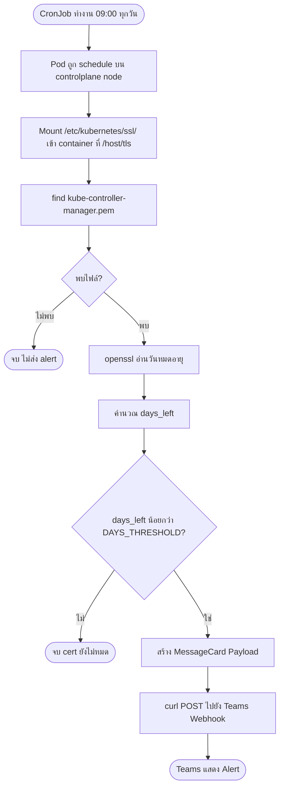
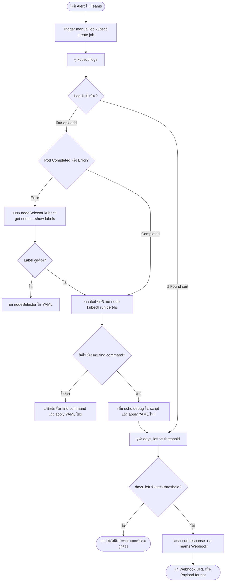

# RKE1 Cert Checker CronJob — Troubleshooting Guide

## Flow การทำงานของระบบ



## Flow การ Troubleshoot เมื่อไม่มี Alert



---

## Overview

CronJob สำหรับตรวจสอบวันหมดอายุของ Kubernetes certificate บน RKE1 cluster และส่ง alert ไปยัง Microsoft Teams ผ่าน Incoming Webhook

---

## Architecture

### วัตถุประสงค์
- ตรวจสอบ certificate `kube-controller-manager.pem` บน controlplane node
- แจ้งเตือนผ่าน Teams เมื่อ cert เหลือน้อยกว่า `DAYS_THRESHOLD`

### การทำงาน
1. CronJob รันทุกวัน เวลา **09:00**
2. Pod ถูก schedule บน controlplane node ผ่าน `nodeSelector`
3. Mount `/etc/kubernetes/ssl/` จาก host เข้า container ที่ `/host/tls`
4. ใช้ `openssl` อ่านวันหมดอายุของ cert
5. คำนวณ `days_left` แล้วเปรียบเทียบกับ `DAYS_THRESHOLD`
6. ส่ง MessageCard ไปยัง Teams webhook หาก `days_left < DAYS_THRESHOLD`

### Cluster ที่ใช้งาน
| Cluster | Public IP | Namespace |
|---|---|---|
| MOPH Claim Phase 2 | 203.154.171.145 | kube-system |

---

## YAML Reference

```yaml
apiVersion: batch/v1
kind: CronJob
metadata:
  name: ols-cert-checker-rke1
  namespace: kube-system
spec:
  schedule: "0 9 * * *"
  jobTemplate:
    spec:
      template:
        spec:
          nodeSelector:
            node-role.kubernetes.io/controlplane: "true"
          tolerations:
          - operator: Exists
          containers:
          - name: checker
            image: alpine:latest
            securityContext:
              privileged: true
              runAsUser: 0
            volumeMounts:
            - name: rke1-certs-dir
              mountPath: /host/tls
              readOnly: true
            command: ["/bin/sh"]
            args:
              - "-c"
              - |
                apk add --no-cache openssl curl sed

                WEBHOOK_URL="<TEAMS_WEBHOOK_URL>"
                DAYS_THRESHOLD=400
                CLUSTER_NAME="MOPH Claim Phase 2"
                PUBLIC_IP="203.154.171.145"

                for cert in $(find /host/tls -name "kube-controller-manager.pem"); do
                    echo "Found cert: $cert"
                    raw_date=$(openssl x509 -in "$cert" -noout -enddate | cut -d= -f2)
                    clean_date=$(echo "$raw_date" | sed 's/ GMT//g')
                    [ -z "$clean_date" ] && echo "Empty date, skip" && continue

                    expiry_epoch=$(date -d "$clean_date" +%s)
                    now_epoch=$(date +%s)
                    days_left=$(( ($expiry_epoch - $now_epoch) / 86400 ))
                    expiry_fmt=$(date -d "$clean_date" +'%Y-%m-%d')
                    filename=$(basename "$cert")

                    echo "days_left=$days_left threshold=$DAYS_THRESHOLD"

                    if [ "$days_left" -lt "$DAYS_THRESHOLD" ]; then
                        PAYLOAD="{
                            \"@type\": \"MessageCard\",
                            \"@context\": \"http://schema.org/extensions\",
                            \"themeColor\": \"F8A102\",
                            \"summary\": \"RKE1 Cert Expiry\",
                            \"sections\": [{
                                \"activityTitle\": \"⚠️ RKE1 Cert Expiry: $filename\",
                                \"facts\": [
                                    { \"name\": \"Cluster:\", \"value\": \"$CLUSTER_NAME\" },
                                    { \"name\": \"Public IP:\", \"value\": \"$PUBLIC_IP\" },
                                    { \"name\": \"Expiry Date:\", \"value\": \"$expiry_fmt\" },
                                    { \"name\": \"Days Remaining:\", \"value\": \"$days_left Days\" }
                                ],
                                \"markdown\": true
                            }]
                        }"
                        curl -s -X POST -H "Content-Type: application/json" -d "$PAYLOAD" "$WEBHOOK_URL"
                        echo "Alert sent"
                    fi
                done
          restartPolicy: OnFailure
          volumes:
          - name: rke1-certs-dir
            hostPath:
              path: /etc/kubernetes/ssl/
              type: Directory
```

### Key Configurations
| Parameter | Value | หมายเหตุ |
|---|---|---|
| `schedule` | `0 9 * * *` | รันทุกวัน 09:00 |
| `nodeSelector` | `node-role.kubernetes.io/controlplane: "true"` | RKE1 ใช้ label นี้ |
| `hostPath` | `/etc/kubernetes/ssl/` | path cert บน RKE1 master node |
| `DAYS_THRESHOLD` | `400` | แจ้งเตือนเมื่อเหลือน้อยกว่า 400 วัน |
| cert filename | `kube-controller-manager.pem` | RKE1 ใช้ `.pem` ไม่ใช่ `.crt` |

---

## การ Debug

### เครื่องมือที่ใช้
- `kubectl create job` — trigger job รันทันทีโดยไม่รอ schedule
- `kubectl logs` — ดู output ของ script
- `kubectl run --overrides` — รัน pod แบบ custom spec เพื่อ inspect node
- `echo` debug ใน script — แสดงค่าตัวแปรระหว่าง runtime

---

### ขั้นตอน Debug ตามลำดับ

#### 1. ตรวจสอบ Log หลัง apply
```bash
kubectl create job --from=cronjob/ols-cert-checker-rke1 cert-debug -n kube-system
kubectl get pods -n kube-system | grep cert-debug
kubectl logs <pod-name> -n kube-system
```
**สิ่งที่ดู:** Log หยุดแค่ `apk add` หรือมี output ต่อ

---

#### 2. ตรวจสอบ Node Label
```bash
kubectl get nodes --show-labels | grep -i control
```
**สิ่งที่ดู:** ต้องเจอ `node-role.kubernetes.io/controlplane=true`

**⚠️ RKE1 vs RKE2 — label ต่างกัน**

| Cluster | Label |
|---|---|
| RKE1 | `node-role.kubernetes.io/controlplane` |
| RKE2 | `node-role.kubernetes.io/control-plane` |

---

#### 3. ตรวจสอบ Directory และชื่อไฟล์ cert จริงบน Master Node
```bash
kubectl run cert-ls \
  --image=alpine \
  --restart=Never \
  --overrides='{"spec":{"nodeSelector":{"node-role.kubernetes.io/controlplane":"true"},"tolerations":[{"operator":"Exists"}],"volumes":[{"name":"ssl","hostPath":{"path":"/etc/kubernetes/ssl/"}}],"containers":[{"name":"ls","image":"alpine","command":["ls","-la","/host/ssl/"],"volumeMounts":[{"name":"ssl","mountPath":"/host/ssl"}]}]}}' \
  -n kube-system

# รอ pod complete แล้วดู log
kubectl logs cert-ls -n kube-system
kubectl delete pod cert-ls -n kube-system
```
**สิ่งที่ดู:** ชื่อไฟล์จริงใน directory — RKE1 ใช้ `.pem` ไม่ใช่ `.crt`

---

#### 4. เพิ่ม echo debug ใน script
เพิ่ม 2 บรรทัดนี้ใน script ก่อน `if`:
```bash
echo "Found cert: $cert"
echo "days_left=$days_left threshold=$DAYS_THRESHOLD"
```
**สิ่งที่ดู:** ค่า `days_left` จริงเพื่อเปรียบเทียบกับ `DAYS_THRESHOLD`

---

## Root Cause & Solution

### กรณี MOPH Claim Phase 2

| ขั้นตอน | สิ่งที่พบ |
|---|---|
| ดู log | หยุดแค่ `apk add` ไม่มี output ต่อ |
| ดู directory | ไฟล์มีอยู่จริงชื่อ `kube-controller-manager.pem` |
| เพิ่ม echo debug | `days_left=2629 threshold=400` |
| **สาเหตุจริง** | **cert เหลือ 2629 วัน > threshold 400 วัน → ไม่ส่ง alert ถูกต้องแล้ว** |

> ✅ **Script ทำงานถูกต้อง** ไม่มี bug ไม่ต้องแก้ไข YAML

---

## Common Issues

### find ไม่เจอไฟล์
**อาการ:** Log หยุดแค่ `apk add` ไม่มีบรรทัด `Found cert:`

**สาเหตุที่เป็นไปได้:**
1. ชื่อไฟล์ไม่ตรง (`.crt` vs `.pem`)
2. `hostPath` ผิด directory
3. Syntax `\( \)` ใน find command escape ไม่ถูกต้องใน YAML args

**วิธีแก้:** ใช้ `kubectl run cert-ls` ดูชื่อไฟล์จริงก่อนเสมอ

---

### SSH เข้าผิด Node
**อาการ:** `ls /etc/kubernetes/ssl/` แสดง `No such file or directory`

**สาเหตุ:** SSH เข้า Rancher Server แทนที่จะเป็น master node

**วิธีแก้:** ใช้ `kubectl run --overrides` inspect node ผ่าน Kubernetes แทนการ SSH โดยตรง

---

### Log ว่างหลัง apk add
**อาการ:** `kubectl logs` แสดงแค่ package install แล้วจบ

**สาเหตุ:** `find` ไม่เจอไฟล์ → loop ไม่ทำงาน → ไม่มี output

**วิธีแก้:** เพิ่ม `echo` debug ใน script เพื่อดูว่า find เจอไฟล์หรือไม่

---

## Useful Commands

### Trigger Manual Job
```bash
kubectl create job --from=cronjob/ols-cert-checker-rke1 cert-test-manual -n kube-system
```

### ดู Logs
```bash
# ดู pod name ก่อน
kubectl get pods -n kube-system | grep cert-test

# ดู log
kubectl logs <pod-name> -n kube-system
```

### Cleanup Test Resources
```bash
kubectl delete job cert-debug -n kube-system
kubectl delete job cert-test -n kube-system
kubectl delete pod cert-ls -n kube-system
```

### ตรวจสอบ CronJob Status
```bash
kubectl get cronjob ols-cert-checker-rke1 -n kube-system
```

---

## Lessons Learned

1. **เพิ่ม `echo` debug ใน script เสมอ** — ทำให้เห็น runtime value ของตัวแปรสำคัญ โดยเฉพาะ `days_left` และ `threshold`

2. **อย่า SSH เข้า Rancher Server แล้ว test path** — ใช้ `kubectl run --overrides` เพื่อ inspect บน node จริงแทน

3. **RKE1 cert ใช้ `.pem` ไม่ใช่ `.crt`** — ต่างจาก RKE2 ต้องตรวจสอบก่อน deploy ทุกครั้ง

4. **Log ว่างไม่ได้แปลว่า error** — อาจแค่ไม่เข้า condition ต้องดู `days_left` ก่อนสรุป