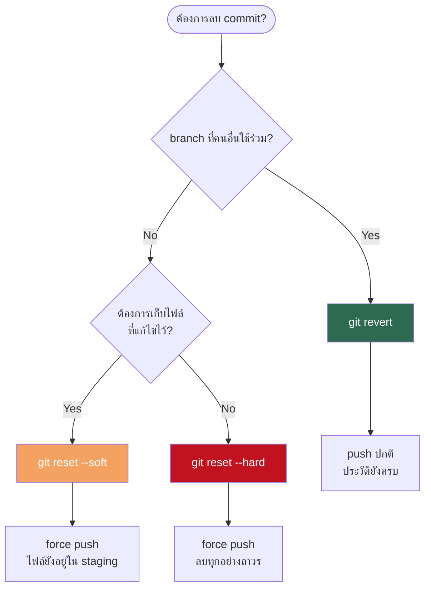

# การลบ Commit ล่าสุดที่ Push ไปแล้ว

- หมวดหมู่: Git / Version Control  
- ระดับ: Developer ทุกระดับ  
- อัปเดตล่าสุด: 2025

เมื่อ commit ถูก push ขึ้น remote repository ไปแล้ว การลบหรือย้อนกลับมีผลกระทบต่อสมาชิกในทีมทุกคน จึงต้องเลือกวิธีให้เหมาะกับสถานการณ์ก่อนดำเนินการเสมอ

กฎสำคัญ: ห้าม force push บน `main` / `master` หรือ branch ที่ทีมใช้ร่วมกัน โดยไม่ได้รับอนุญาตจาก Lead / Repository Owner



---

## วิธีที่ 1 — `git revert` (shared branch)

สร้าง commit ใหม่ที่ย้อนกลับการเปลี่ยนแปลง ประวัติยังครบ ไม่กระทบสมาชิกคนอื่น

1. ตรวจสอบ branch และ commit ก่อนดำเนินการ
```bash
git branch
git log --oneline -5
```

2. ย้อนกลับ commit ล่าสุด (editor จะเปิด — กด `:wq` เพื่อบันทึกใน vim)
```bash
git revert HEAD
```

3. Push ขึ้น remote ตามปกติ
```bash
git push
```

---

## วิธีที่ 2 — `git reset` + Force Push (branch ส่วนตัวเท่านั้น)

วิธีนี้จะเขียนทับประวัติบน remote ห้ามใช้บน branch ที่มีสมาชิกคนอื่น pull หรือทำงานอยู่

### 2a — Soft Reset (เก็บไฟล์ไว้ใน staging)

ยกเลิก commit แต่ไฟล์ที่แก้ไขยังอยู่ พร้อมแก้ต่อ

1. ย้อนกลับ 1 commit
```bash
git reset --soft HEAD~1
```

2. Force push (ใช้ `--force-with-lease` แทน `--force` เพื่อป้องกันการเขียนทับ commit ของคนอื่นที่ push มาในระหว่างนั้น)
```bash
git push --force-with-lease
```

### 2b — Hard Reset (ลบทุกอย่างถาวร)

ลบ commit และการเปลี่ยนแปลงทั้งหมดออก ไม่สามารถกู้คืนได้

1. ย้อนกลับ 1 commit
```bash
git reset --hard HEAD~1
```

2. Force push
```bash
git push --force-with-lease
```

---

## กรณีพิเศษ

ลบมากกว่า 1 commit — เปลี่ยนตัวเลขเป็นจำนวนที่ต้องการ
```bash
git reset --soft HEAD~3
git push --force-with-lease
```

Branch ถูก protect — ใช้ได้เฉพาะ `git revert` เท่านั้น ติดต่อ Repository Owner หากต้องการปลด protection ชั่วคราว

สมาชิกในทีม pull ไปแล้วหลัง force push — ให้สมาชิกที่ได้รับผลกระทบรัน
```bash
git fetch origin
git reset --hard origin/<branch-name>
```

---

## อ้างอิง

- [Git Documentation — git-revert](https://git-scm.com/docs/git-revert)
- [Git Documentation — git-reset](https://git-scm.com/docs/git-reset)