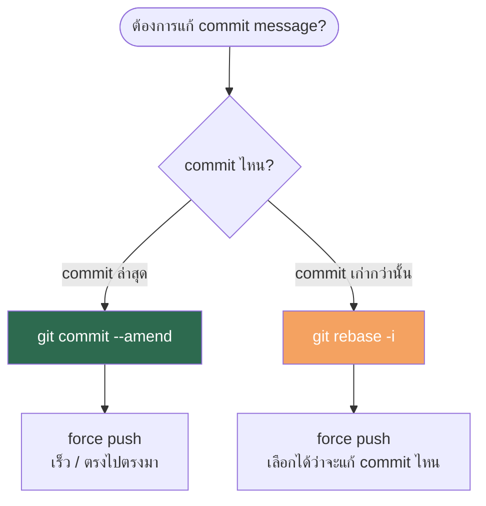

# Git: แก้ไข Commit Message

- หมวดหมู่: Git / Version Control  
- ระดับ: Developer ทุกระดับ  
- อัปเดตล่าสุด: 2025

การแก้ commit message หลัง push ไปแล้วจะทำให้ **commit hash เปลี่ยน**  
และมีผลต่อสมาชิกในทีมที่ pull branch นี้ไปแล้ว



---

## วิธีที่ 1 — `git commit --amend` (แก้ commit ล่าสุด)

1. แก้ message

```bash
git commit --amend -m "docs: ชื่อใหม่ที่ต้องการ"
```

2. Force push

```bash
git push --force-with-lease origin <branch-name>
```

---

## วิธีที่ 2 — `git rebase -i` (แก้ commit เก่า)

1. เปิด interactive rebase — เปลี่ยน `3` เป็นจำนวน commit ที่ต้องการย้อนไป

```bash
git rebase -i HEAD~3
```

2. ใน editor — เปลี่ยน `pick` → `reword` หน้า commit ที่ต้องการแก้ แล้วบันทึกและออก

```
reword daf210f docs: add testcase_deployment.txt
pick   664cdaa docs: add okd pros/cons
```

3. ใช้ VIM อีกครั้ง editor จะแสดง commit message ที่เลือกไว้ แก้ชื่อให้ถูกต้อง แล้วบันทึกและออก (`i` → แก้ → `Esc` → `:wq`)

```
docs: add testcase_deployment.txt
```

4. Force push

```bash
git push --force-with-lease origin <branch-name>
```

---

## Checklist ก่อนดำเนินการ

- [ ] ยืนยันชื่อ branch ด้วย `git branch`
- [ ] ดู commit ที่ต้องการแก้ด้วย `git log --oneline -5`
- [ ] แจ้งทีมหากมีคนอื่นใช้ branch นี้ร่วมด้วย

---

## อ้างอิง

- [Git Documentation — git-commit --amend](https://git-scm.com/docs/git-commit#Documentation/git-commit.txt---amend)
- [Git Documentation — git-rebase](https://git-scm.com/docs/git-rebase)