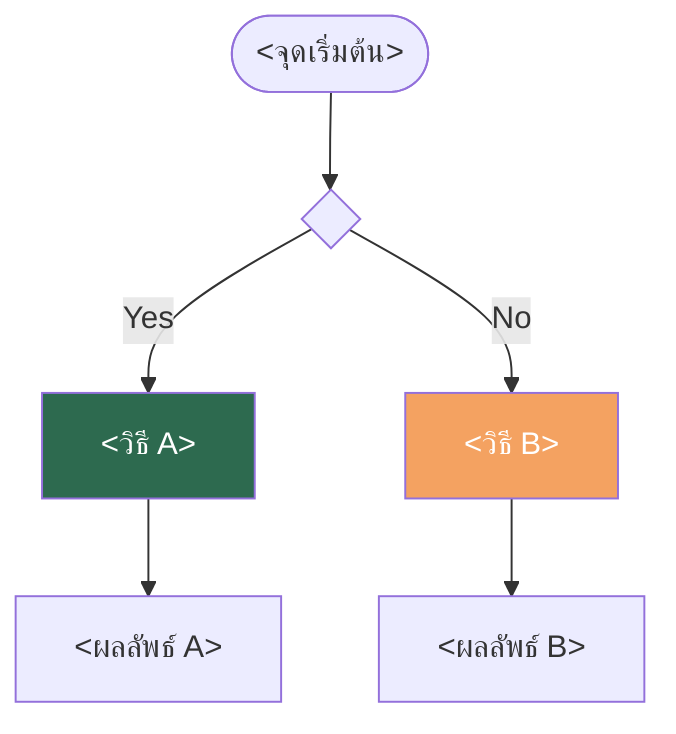

# Git: <ชื่อหัวข้อ>

- หมวดหมู่: Git / Version Control  
- ระดับ: Developer ทุกระดับ  
- อัปเดตล่าสุด: <YYYY>

<อธิบาย 1-2 บรรทัดว่าทำอะไร และผลกระทบที่ควรรู้ก่อนทำ>

กฎสำคัญ: <ถ้ามี warning หลัก ใส่ตรงนี้>



---

## วิธีที่ 1 — `<คำสั่ง>` (<กรณีที่ใช้>)

<อธิบายสั้นๆ ว่าทำอะไร พฤติกรรมที่ควรรู้>

1. <ขั้นตอนแรก>
```bash
<command>
```

2. <ขั้นตอนถัดไป>
```bash
<command>
```

---

## วิธีที่ 2 — `<คำสั่ง>` (<กรณีที่ใช้>)

<อธิบายสั้นๆ>

1. <ขั้นตอน>
```bash
<command>
```

---

## กรณีพิเศษ

<กรณี edge case ที่เจอบ่อย>
```bash
<command>
```

---

## Checklist ก่อนดำเนินการ

- [ ] <ข้อแรก>
- [ ] <ข้อสอง>

---

## อ้างอิง

- [Git Documentation — <หัวข้อ>](<url>)