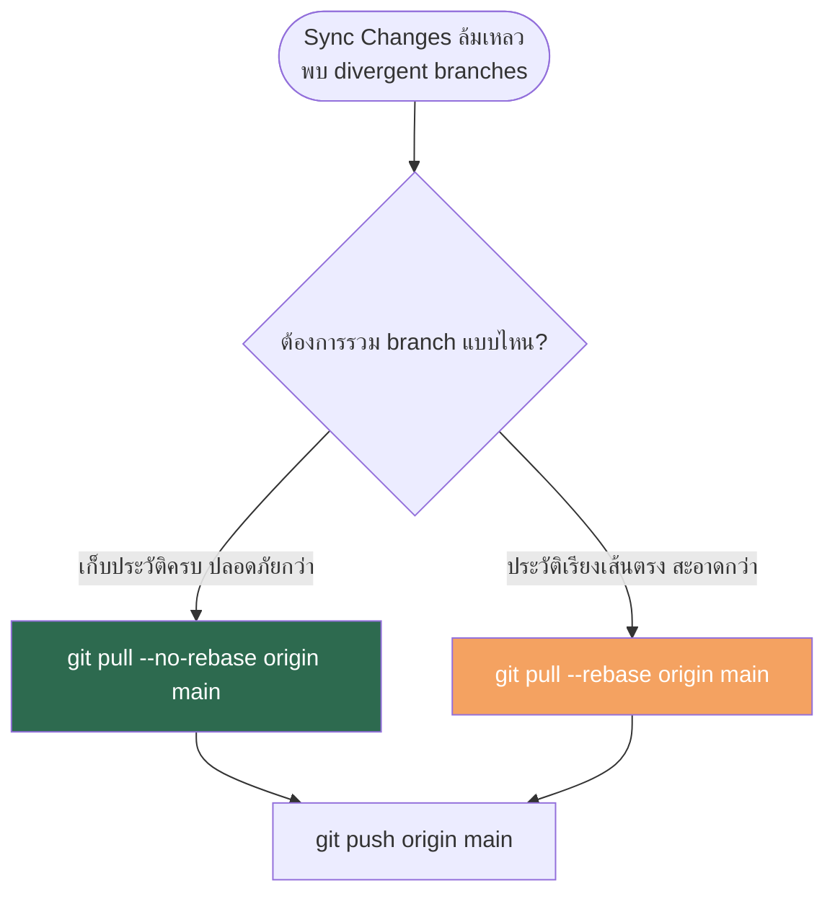

# Git: แก้ปัญหา Branch แยกออกจากกัน (Divergent Branches) ตอน Sync/Push

## สารบัญ

- [ปัญหาที่พบ](#ปัญหาที่พบ)
- [วิธีที่ 1 — Merge (`--no-rebase`) แนะนำสำหรับ branch ที่ push ไปแล้ว](#วิธีที่-1--merge---no-rebase-แนะนำสำหรับ-branch-ที่-push-ไปแล้ว)
- [วิธีที่ 2 — Rebase (`--rebase`) สำหรับประวัติที่ต้องการให้เรียงเป็นเส้นตรง](#วิธีที่-2--rebase---rebase-สำหรับประวัติที่ต้องการให้เรียงเป็นเส้นตรง)
- [ตรวจสอบก่อน Pull (แนะนำ)](#ตรวจสอบก่อน-pull-แนะนำ)
- [อ้างอิง](#อ้างอิง)

---

## ปัญหาที่พบ

เมื่อทั้ง local และ remote branch ต่างมี commit ที่อีกฝ่ายไม่มี (เช่น local push ค้างไว้ 1 commit
และ remote มี commit ใหม่เข้ามา 1 commit) การรัน `git pull` จะล้มเหลวพร้อมข้อความ:

```
hint: You have divergent branches and need to specify how to reconcile them.
hint: You can do so by running one of the following commands sometime before
hint: your next pull:
hint:
hint:   git config pull.rebase false  # merge
hint:   git config pull.rebase true   # rebase
hint:   git config pull.ff only       # fast-forward only
hint:
hint: You can replace "git config" with "git config --global" to set a default
hint: preference for all repositories. You can also pass --rebase, --no-rebase,
hint: or --ff-only on the command line to override the configured default per
hint: invocation.
fatal: Need to specify how to reconcile divergent branches.
```

> บรรทัดที่สำคัญที่สุด (ที่เหลือเป็นแค่คำแนะนำวิธีตั้งค่า)
> ```
> hint: You have divergent branches and need to specify how to reconcile them.
> fatal: Need to specify how to reconcile divergent branches.
> ```
> สรุป: local และ remote มี commit คนละชุดกัน git จึงหยุดทำงานเพราะไม่รู้ว่าจะ merge หรือ rebase

git ไม่สามารถตัดสินใจเองได้ว่าจะ **merge** หรือ **rebase** จึงต้องระบุวิธีให้ชัดเจน



---

## วิธีที่ 1 — Merge (`--no-rebase`) แนะนำสำหรับ branch ที่ push ไปแล้ว

1. Pull พร้อมสั่ง merge

```bash
git pull --no-rebase origin main
```

2. หากไม่มีการแก้ไฟล์เดียวกันในจุดเดียวกัน git จะสร้าง merge commit ให้อัตโนมัติโดยไม่มี conflict

3. Push ตามปกติ (ไม่ต้อง force)

```bash
git push origin main
```

---

## วิธีที่ 2 — Rebase (`--rebase`) สำหรับประวัติที่ต้องการให้เรียงเป็นเส้นตรง

1. Pull พร้อมสั่ง rebase — commit ของเราจะถูกย้ายไปวางต่อท้าย commit ล่าสุดจาก remote

```bash
git pull --rebase origin main
```

2. Push ตามปกติ

```bash
git push origin main
```

คำเตือน ถ้า branch นี้มีคนอื่น pull ไปใช้ร่วมด้วยแล้ว การ rebase จะเปลี่ยน commit hash — ควรแจ้งทีมก่อน

---

## ตรวจสอบก่อน Pull (แนะนำ)

ดูก่อนว่า commit ที่กำลังจะถูกดึงเข้ามามีอะไรบ้าง เพื่อประเมินความเสี่ยงเรื่อง conflict:

```bash
git fetch origin
git log HEAD..origin/main --oneline
```

---

## อ้างอิง

- [Git Documentation — git-pull](https://git-scm.com/docs/git-pull)
- [Git Documentation — git-rebase](https://git-scm.com/docs/git-rebase)
- [Git Documentation — git-merge](https://git-scm.com/docs/git-merge)